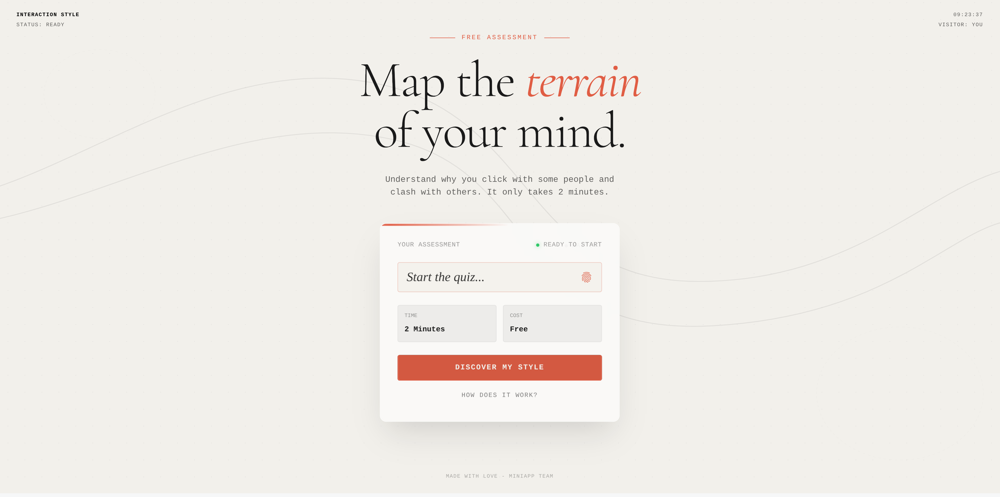

<div align="center">


# Interaction Style

> Discover how you naturally engage with ideas, people, and decisions.

**Interaction Style** is an AI-powered personality assessment mini-app that reveals your unique communication and decision-making patterns. Built with a premium "raw aesthetic" design and powered by Google Gemini.

[](https://vercel.com/new/clone?repository-url=https://github.com/yourusername/interaction-style)

</div>

## ✨ Features

- **AI-Powered Analysis** - Uses Gemini 2.5 Flash to generate nuanced personality insights
- **5 Core Dimensions** - Energy Direction, Information Processing, Decision Making, Lifestyle Orientation, Conflict Style
- **Premium Design** - Glassmorphism, animated backgrounds, custom typography (Cormorant Garamond + Space Mono)
- **Secure** - API key stays server-side via Vercel Serverless Functions
- **Fast** - Built with Vite + React 19 for instant load times

## � Getting Started

### Prerequisites
- Node.js 18+
- A [Gemini API Key](https://aistudio.google.com/apikey)

### Installation

```bash
# Clone the repository
git clone https://github.com/yourusername/interaction-style.git
cd interaction-style

# Install dependencies
npm install

# Create your environment file
cp .env.example .env.local
# Edit .env.local and add your GEMINI_API_KEY

# Start the development server
npm run dev
```

## �️ Tech Stack

| Category | Technology |
|----------|------------|
| **Frontend** | React 19, TypeScript, Framer Motion |
| **Styling** | Tailwind CSS (CDN), Custom CSS |
| **AI** | Google Gemini 2.5 Flash |
| **Backend** | Vercel Serverless Functions |
| **Build** | Vite |
| **Quality** | ESLint, Prettier |

## 📁 Project Structure

```
├── api/
│   └── analyze.ts          # Serverless function for Gemini API
├── components/
│   ├── BrandLayout.tsx     # Shared layout with branding
│   ├── LandingScreen.tsx   # Home page
│   ├── ConsentScreen.tsx   # Consent form
│   ├── QuestionnaireScreen.tsx
│   ├── AnalyzingScreen.tsx # Loading animation
│   ├── SummaryScreen.tsx   # Results overview
│   └── DetailsScreen.tsx   # Detailed breakdown
├── services/
│   └── geminiService.ts    # Frontend API client
└── types.ts                # TypeScript interfaces
```

## 🚢 Deployment

### Deploy to Vercel

1. Push your code to GitHub
2. Import project on [Vercel](https://vercel.com/new)
3. Add environment variable: `GEMINI_API_KEY`
4. Deploy!

### Manual Deploy

```bash
npx vercel --prod
```

## 📝 Scripts

| Command | Description |
|---------|-------------|
| `npm run dev` | Start development server |
| `npm run build` | Build for production |
| `npm run lint` | Check for lint errors |
| `npm run lint:fix` | Auto-fix lint errors |
| `npm run format` | Format code with Prettier |

## 🤝 Contributing

Contributions are welcome! Feel free to open an issue or submit a PR.

## 📄 License

This project is licensed under the [MIT License](LICENSE).
